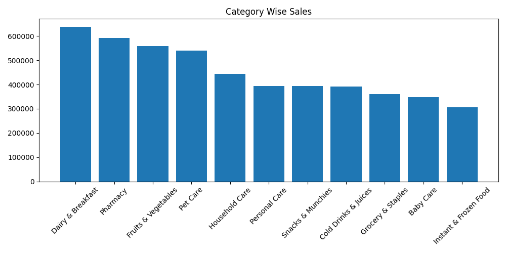
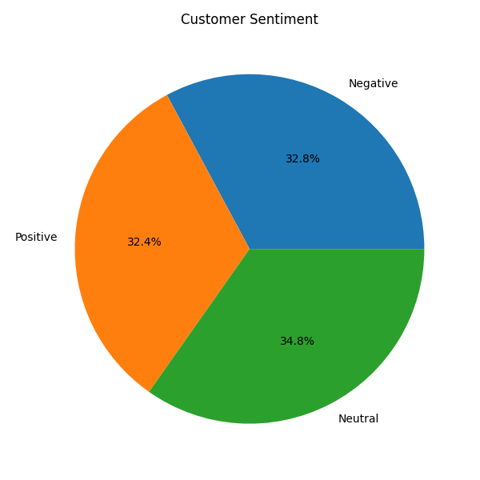
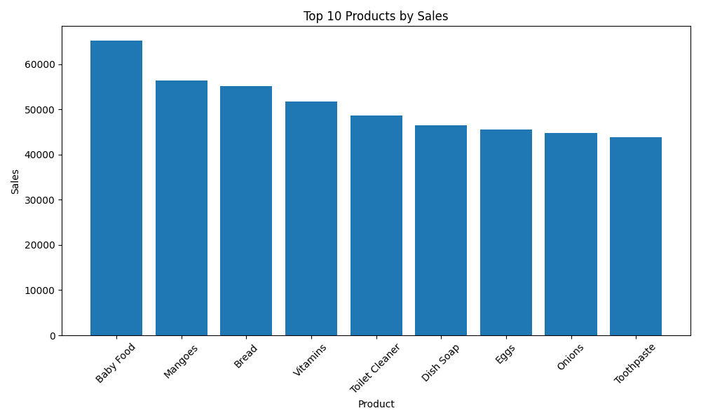

# Blinkit End-to-End Data Analytics Project

End-to-end data analytics project on Blinkit sales, customer feedback, and inventory data — built using **Python, PostgreSQL (SQL), and Power BI**.

The project takes a raw, messy Kaggle dataset through a full pipeline: data cleaning → exploratory analysis → relational database design → advanced SQL analysis → an interactive 3-page Power BI dashboard.

---

## 📊 Dashboard Preview

| Executive Dashboard | Customer & Sales Analysis | Product & Inventory Analysis |
|---|---|---|
|  |  |  |

---

## 🛠️ Tech Stack

- **Python** — Pandas, NumPy, Matplotlib, Seaborn, Psycopg2
- **PostgreSQL** — database design, JOINs, Window Functions, CTEs, Views
- **Power BI** — 3-page interactive dashboard with custom SVG KPI icons
- **Tools** — Jupyter Notebook, VS Code, pgAdmin

---

## 📁 Project Structure

```
Blinkit-End-to-End-Data-Analytics-Project/
├── data/
│   ├── raw/            # Original Kaggle CSVs (customers, orders, products, inventory, delivery, marketing, feedback)
│   └── cleaned/         # Cleaned datasets after preprocessing
├── notebooks/
│   └── Blinkit_Data_Analysis.ipynb   # Full data cleaning + EDA notebook
├── python/               # Modular analysis scripts (01–12): loading, EDA, sales, category,
│                          # payment, delivery, product, customer, feedback analysis, visualization, export
├── sql/                   # Database creation, table design, import, business queries,
│                          # joins, window functions, views, indexes, constraints (01–09)
├── powerbi/
│   └── Blinkit_end_to_end_project_dashboard1.pbit
├── images/                # Chart exports used in the report and dashboard
├── reports/
│   ├── Blinkit_Project_Report_FINAL_1.docx
│   └── final_report.xlsx
└── README.md
```

---

## 🔍 Key Insights

- Total revenue of **₹4.97M** across **5K orders** from **2.172K customers**, with an average order value of ₹994.48.
- Payment methods are evenly split — Cash, UPI, Wallet, and Card each account for roughly 25% of transactions.
- **~49% of received stock (68K out of 139K units) is marked as damaged** — the single biggest inventory issue found in the data.
- Average customer rating is **3.34/5**, with sentiment nearly evenly split between Positive, Negative, and Neutral.
- Sales peak between **May–August** and drop sharply from November into December.
- Dairy & Breakfast and Pharmacy are the top revenue-generating categories.

*(Full write-up with all insights and business recommendations is in [`reports/`](reports/).)*

---

## ⚙️ How It Works

1. **Data Cleaning (Python)** — missing values, duplicates, and data types handled in `notebooks/Blinkit_Data_Analysis.ipynb`.
2. **Database Import (pgAdmin)** — cleaned CSVs imported into PostgreSQL tables using pgAdmin's Import/Export feature.
3. **SQL Analysis** — business queries, JOINs, window functions, CTEs, and views written in `sql/`.
4. **Python Analysis** — further business analysis pulling data back from PostgreSQL via Psycopg2 (`python/`).
5. **Power BI Dashboard** — 3-page interactive report (Executive, Customer & Sales, Product & Inventory) built on the PostgreSQL tables.

---

## 👤 Author

**Vikash Kumar** — B.Tech CSE
Built as a portfolio project for data analytics internship applications.
